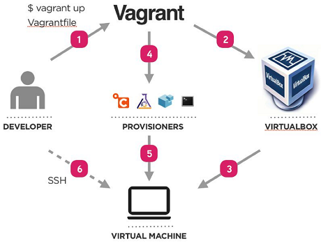

[](https://circleci.com/gh/theodore86/vagrantenv/tree/main)
[](https://opensource.org/licenses/MIT)


# SandBox for Testing and Developing as a code
Provisioning of the sandbox using the Vagrant automation tool (IaC).  
Fully managed and provisioned through [Ansible](https://www.ansible.com) roles.

## What is Vagrant
[Vagrant](https://www.vagrantup.com/docs/index.html) is an tool for building and managing virtual machine environments in an sigle workflow.

Provides easy to configure, reproducible and portable work environments built on top of industry-standard technology
and controlled by an single consistent workflow to help maximize the productivity and flexibility.

Vagrant has a concept of `providers` which map to the virtualisation engine and its API.
The most popular and well-supported provider is Virtualbox; plugins exist for `libvirt`, `kvm`, `lxc`, `vmware` and more

## Requirements:

### Intel VT-x virtualization
Many PC laptops (especially those from Lenovo, HP and Dell) have **Intel's VT-x virtualization**
turned off by default, which can cause issues with many Vagrant boxes. Enable VT-x in your system BIOS/UEFI settings.

### Git
Install the [Git](https://git-scm.com/book/en/v1/Getting-Started-Installing-Git) command line tool.

- On *Linux OS/Mac OS X* use your distribution package manager.
- On *Windows OS* download and install [Git](https://git-scm.com/download/win).
  - Don't forget to include the **Git BASH** during installation.

#### Linux OS/Mac OS X
Use your distribution package manager and install the following `mandatory` packages:

- [VirtualBox](https://www.virtualbox.org/wiki/Downloads) `mandatory`
- [Vagrant](https://www.vagrantup.com/downloads.html) `mandatory`
- [SublimeText](http://docs.sublimetext.info/en/latest/getting_started/install.html) `optional`

#### Windows OS
* Install (as Administrator) the Package Manager [Chocolatey](https://chocolatey.org/install):

The following `mandatory` packages must be installed through Chocolatey:

* [VirtualBox](https://chocolatey.org/packages/virtualbox) `mandatory`
* [Vagrant](https://chocolatey.org/packages/vagrant) `mandatory`
* [Cmder](https://chocolatey.org/packages/Cmder) or [Cygwin](https://chocolatey.org/packages/Cygwin) `optional`
* [Python3](https://chocolatey.org/packages/python3) `optional`
* [SublimeText](https://chocolatey.org/packages/SublimeText3) `optional`

**There is no need to install the above packages manually**, use the automated steps as described [below](#windows-host-provisioning).

*In case of Windows 7 install the Powershell patch:*

* [Vagrant requires Powershell version 3 or later](https://stackoverflow.com/questions/1825585/determine-installed-powershell-version)
* [Install the patch Windows6.1-KB2506143-x64.msu](https://www.microsoft.com/en-us/download/details.aspx?id=34595)

## Vagrant Box

### Base Box
Based on Ubuntu `focal/20.04` box from: [HashiCorp's Vagrant Cloud](https://app.vagrantup.com/ubuntu/boxes/focal64)

### Hashicorp
- vagrant
- vault

### Containerization
- docker
- docker-compose
- kubectl
- helm
- kind
- k9s
- kubectx

### Network Protocol Analyzers
- tshark

### Git
- git-core
- git-lfs
- git-crypt

### JVM
- openjdk
- groovy
- maven

### Ruby
- Gem
- Bundle

### GO
- go
  - github.com/nektos/act
  - golang.org/x/lint/golint
  - github.com/rhysd/actionlint

### Python
- python-dev
- python3.8-dev
- pip
- tox
- ansible
  - paramiko

### VIM Plugins
- Robot Framework
- Jinja2

### Linters
- hadolint

### Browsers
- midori

### User Workspace Settings
- .vimrc
- .gitconfig
- .bash_profile
- .bash_aliases
- ipython_config.py
- .lsyncd.config.lua

### Other
- lynx
- socat
- sshpass
- jq
- yq
- bridge-utils
- x11-apps
- xdg-utils
- lsyncd

## Accessing the Project Source Code
In order to *clone* the project source code you need:

1. Request membership to [vagrantenv](git@github.com:theodore86/vagrantenv.git) project.

## Windows Host Provisioning
Open Git BASH as **Administrator**:
```console
git clone git@github.com:theodore86/vagrantenv.git
cd vagrantenv/tools/windows
cmd "/C provision.bat"
shutdown /r (Reboot Windows PC)
```

## Linux Host Provisioning
Open your terminal:
```console
git clone git@github.com:theodore86/vagrantenv.git
cd vagrantenv/tools/linux
bash provision.sh
sudo shutdown -r (Reboot your Linux PC)
```

## Bringing Up the Virtual Machine
```console
cd vagrantenv
export HTTP(S)_PROXY=x.x.x.x:8080 (if behind proxy)
vagrant up
vagrant ssh
```

## Updating the Virtual Machine
```console
cd vagrantenv
git pull
vagrant box update
vagrant up or reload
vagrant ssh
```

## Project Structure
```bash
vagrantenv
├── AUTHORS.md
├── bin (d)
├── CHANGELOG.md
├── CONTRIBUTING.md
├── Dockerfile
├── docs (d)
├── Gemfile
├── Gemfile.lock
├── lib (d)
├── LICENSE
├── mkdocs.yml
├── provisioners (d)
├── README.md
├── requirements.d (d)
├── tools (d)
├── tox.ini
├── Vagrantfile
└── vagrant.yaml
```

* ``bin``: Project executables
* ``Dockerfile``: File to build project CI docker containers
* ``docs``: Project documentation
* ``lib``:  Vagrant ruby helper modules
* ``provisioners``: Vagrant (shell, ansible) provisioners
* ``requirements.d``: Python project dependencies
* ``tools``: Generic project tools
* ``tox.ini``: Test automation command line tool
* ``vagrant.yaml``: Vagrant central configuration file
* ``Vagrantfile``: Vagrant main ruby file


## Documentation

For more details, generate and serve [locally](http://localhost:8000) the project documentation:

```console
tox -e docs -- --dev-addr 0.0.0.0:8000
```


## In a Nuschell

