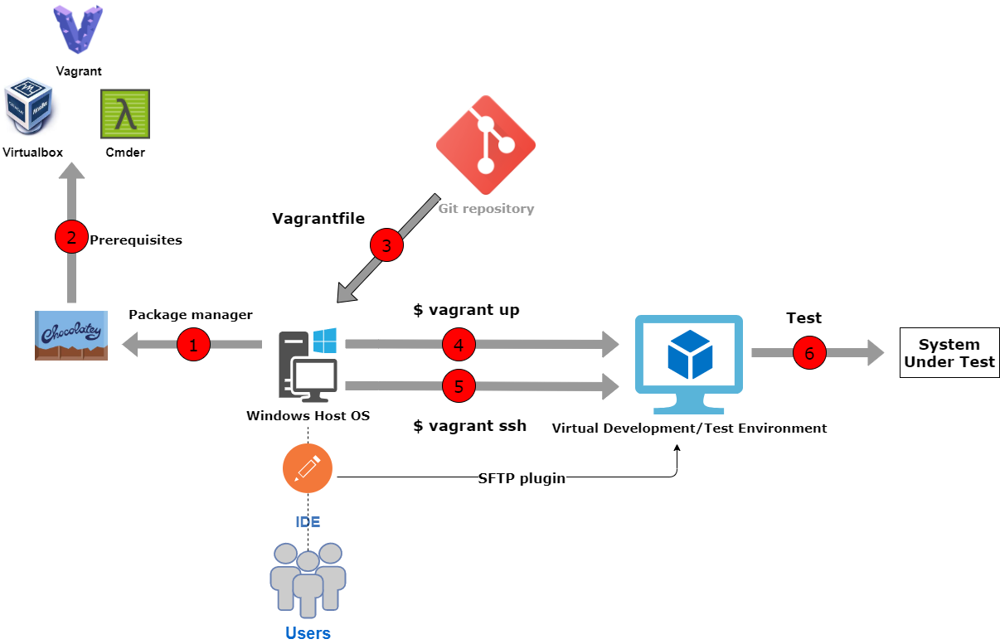
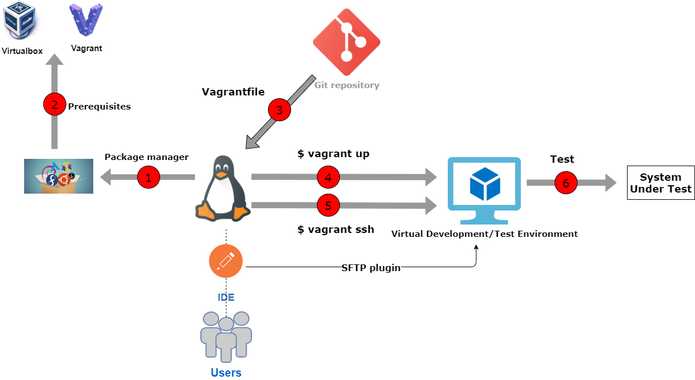

**Test and development** workflow using Vagrant includes:

- Workspace - Host OS (*Windows or Linux*)
- The (Ubuntu) Base Box (*Guest OS*)
- Git repository (*Vagrantfile*)
- Git or Git BASH
- [Chocolatey](../../chocolatey/guide/#what-is-chocolatey) package manager (**Windows OS**)
- Command Line Emulator such as [Cmder](../../cmder/guide/#what-is-cmder) (**Windows OS**)
- IDE (*Sublime, Atom, VSCode*, etc)
- System Under Test (*optional*)

Workflows:

 - **Windows OS**

 - **Linux OS/Mac OS**

